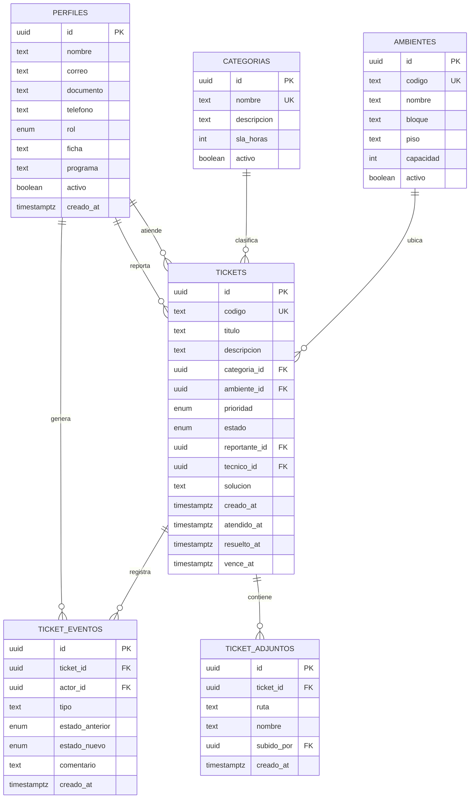

# 3. Modelo de datos

## 3.1 Diagrama entidad-relación

> Para el documento escrito puedes pegar este bloque en [mermaid.live](https://mermaid.live)
> y exportarlo como imagen PNG.

## 3.2 Diccionario de datos

### Tabla `perfiles`

Extiende la tabla `auth.users` que administra Supabase. Se crea automáticamente con un
*trigger* cuando alguien se registra.

| Campo | Tipo | Nulo | Descripción |
|---|---|---|---|
| `id` | uuid | No | Llave primaria. Referencia a `auth.users(id)` |
| `nombre` | text | No | Nombre completo del usuario |
| `correo` | text | Sí | Correo con el que se registró |
| `documento` | text | Sí | Documento de identidad |
| `telefono` | text | Sí | Número de contacto |
| `rol` | rol_usuario | No | `aprendiz` (defecto), `tecnico` o `admin` |
| `ficha` | text | Sí | Número de ficha del aprendiz |
| `programa` | text | Sí | Programa de formación |
| `activo` | boolean | No | Permite inhabilitar sin borrar |
| `creado_at` | timestamptz | No | Fecha de creación |

### Tabla `ambientes`

| Campo | Tipo | Nulo | Descripción |
|---|---|---|---|
| `id` | uuid | No | Llave primaria |
| `codigo` | text | No | Código único del ambiente (A-101) |
| `nombre` | text | No | Nombre descriptivo |
| `bloque` | text | Sí | Bloque o torre |
| `piso` | text | Sí | Piso |
| `capacidad` | integer | Sí | Número de puestos. Debe ser mayor a 0 |
| `activo` | boolean | No | Si el ambiente está en uso |

### Tabla `categorias`

| Campo | Tipo | Nulo | Descripción |
|---|---|---|---|
| `id` | uuid | No | Llave primaria |
| `nombre` | text | No | Nombre único de la categoría |
| `descripcion` | text | Sí | Qué tipo de fallas cubre |
| `sla_horas` | integer | No | Tiempo base de atención en horas. Mayor a 0 |
| `activo` | boolean | No | Si se puede seleccionar al crear un ticket |

### Tabla `tickets`

| Campo | Tipo | Nulo | Descripción |
|---|---|---|---|
| `id` | uuid | No | Llave primaria |
| `codigo` | text | Sí* | Consecutivo `MA-AAAA-NNNN`. Lo genera un trigger |
| `titulo` | text | No | Resumen de la falla. Entre 5 y 120 caracteres |
| `descripcion` | text | No | Detalle. Mínimo 10 caracteres |
| `categoria_id` | uuid | Sí | Referencia a `categorias` |
| `ambiente_id` | uuid | Sí | Referencia a `ambientes` |
| `prioridad` | prioridad_ticket | No | `baja`, `media` (defecto), `alta`. Ordena el trabajo, no altera el reloj |
| `estado` | estado_ticket | No | `pendiente` (defecto), `en_proceso`, `resuelto`, `cancelado` |
| `reportante_id` | uuid | No | Quién reportó la falla |
| `tecnico_id` | uuid | Sí | Quién la atiende. Nulo mientras nadie la tome |
| `solucion` | text | Sí | Qué se hizo para resolverla. Obligatoria al resolver |
| `creado_at` | timestamptz | No | Fecha del reporte |
| `atendido_at` | timestamptz | Sí | Cuándo un técnico la tomó |
| `resuelto_at` | timestamptz | Sí | Cuándo se marcó resuelta |
| `vence_at` | timestamptz | Sí | Límite del tiempo de atención. Lo calcula un trigger |

\* Es nulo en el `INSERT` porque el trigger lo asigna antes de guardar.

### Tabla `ticket_eventos`

Bitácora de trazabilidad. **Solo la escriben los triggers de la base de datos**, por eso el
historial no se puede alterar desde la aplicación.

| Campo | Tipo | Nulo | Descripción |
|---|---|---|---|
| `id` | uuid | No | Llave primaria |
| `ticket_id` | uuid | No | Ticket al que pertenece. Se borra en cascada |
| `actor_id` | uuid | Sí | Quién generó el evento |
| `tipo` | text | No | `creacion` o `cambio_estado` |
| `estado_anterior` | estado_ticket | Sí | Estado del que venía |
| `estado_nuevo` | estado_ticket | Sí | Estado al que pasó |
| `comentario` | text | Sí | Detalle del evento |
| `creado_at` | timestamptz | No | Fecha del evento |

## 3.3 Reglas de negocio implementadas en la base de datos

| Regla | Cómo se implementa |
|---|---|
| Todo usuario nuevo tiene perfil | Trigger `trg_nuevo_usuario` sobre `auth.users` |
| Todo ticket tiene código único | Secuencia `seq_ticket` + trigger `trg_codigo_ticket` |
| El tiempo de atención lo define la categoría | Trigger `trg_vencimiento` |
| Las fechas de cada estado se registran solas | Trigger `trg_seguimiento_estado` |
| Todo cambio de estado queda en la bitácora | Triggers `trg_evento_insert` y `trg_evento_update` |
| El título tiene entre 5 y 120 caracteres | `CHECK` en la tabla |
| La descripción tiene al menos 10 caracteres | `CHECK` en la tabla |
| Cada quien ve solo lo que le corresponde | Políticas RLS por rol |

## 3.4 Seguridad a nivel de fila (RLS)

Esta es la parte que conviene resaltar en la sustentación: **la seguridad no está en la
aplicación, está en la base de datos**. Aunque alguien use directamente la API de Supabase
con la llave pública, el motor solo le devuelve las filas que le corresponden.

| Tabla | Quién puede leer | Quién puede escribir |
|---|---|---|
| `perfiles` | El dueño del perfil; técnicos y admin ven todos | Cada quien el suyo; el admin todos |
| `ambientes` / `categorias` | Cualquier usuario autenticado | Solo el admin |
| `tickets` | El reportante, el técnico que la atiende, cualquier técnico si está sin atender, y el admin | Crear: cualquiera como reportante. Modificar: solo el equipo de soporte |
| `ticket_eventos` | Quien pueda ver el ticket | Los triggers del sistema |

Para evitar la recursión infinita que ocurre cuando una política de `perfiles` consulta la
propia tabla `perfiles`, el rol se obtiene con funciones `SECURITY DEFINER`
(`fn_es_admin()`, `fn_es_soporte()`).

## 3.5 Vistas

| Vista | Para qué sirve |
|---|---|
| `v_tickets_detalle` | Ticket con los nombres de categoría, ambiente, reportante y técnico ya resueltos, más el cálculo de si está dentro del SLA y los tiempos en horas |
| `v_indicadores` | Una sola fila con todos los totales y promedios del tablero |
| `v_tickets_por_ambiente` | Conteo de tickets y pendientes por ambiente, ordenado de mayor a menor |
