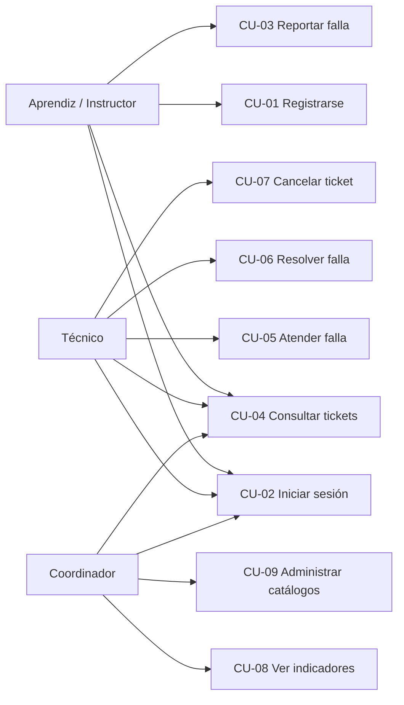

# 4. Casos de uso

## 4.1 Diagrama de casos de uso

---

## CU-01 · Registrarse

| | |
|---|---|
| **Actor** | Aprendiz / Instructor |
| **Precondición** | El usuario no tiene cuenta |
| **Postcondición** | Existe un usuario en `auth.users` y su perfil en `perfiles` con rol `aprendiz` |

**Flujo principal**
1. El usuario abre la aplicación y presiona *Regístrate*.
2. El sistema muestra el formulario de registro.
3. El usuario digita nombre, correo, contraseña y, opcionalmente, ficha, programa y teléfono.
4. El usuario presiona *Registrarme*.
5. El sistema valida que los campos obligatorios estén completos y la contraseña tenga al
   menos 6 caracteres.
6. El sistema crea la cuenta y, mediante el trigger `trg_nuevo_usuario`, el perfil asociado.
7. El sistema informa que la cuenta fue creada y redirige al inicio de sesión.

**Flujos alternos**
- *5a. Campos incompletos:* el sistema muestra "El nombre, el correo y la contraseña son
  obligatorios" y no envía el formulario.
- *5b. Contraseña corta:* el sistema muestra "La contraseña debe tener al menos 6 caracteres".
- *6a. Correo ya registrado:* el sistema muestra el mensaje devuelto por el servicio de
  autenticación y no crea una cuenta duplicada.

---

## CU-03 · Reportar una falla

| | |
|---|---|
| **Actor** | Aprendiz / Instructor / Técnico |
| **Precondición** | El usuario tiene sesión iniciada |
| **Postcondición** | Existe un ticket en estado `abierto` con código consecutivo y fecha de vencimiento calculada |

**Flujo principal**
1. El usuario presiona *Nuevo reporte* desde la pantalla de inicio.
2. El sistema carga las categorías y los ambientes activos.
3. El usuario escribe el título y la descripción de la falla.
4. El usuario selecciona categoría, ambiente y prioridad.
5. El sistema muestra el tiempo de atención comprometido para la categoría elegida.
6. El usuario presiona *Enviar reporte*.
7. El sistema valida las longitudes mínimas del título y la descripción.
8. El sistema inserta el ticket; los triggers asignan el código, calculan `vence_at` y
   registran el evento de creación.
9. El sistema abre el detalle del ticket recién creado.

**Flujos alternos**
- *7a. Título con menos de 5 caracteres:* mensaje de validación, no se guarda.
- *7b. Descripción con menos de 10 caracteres:* mensaje de validación, no se guarda.
- *8a. Error de conexión:* el sistema muestra el mensaje del servidor y conserva lo digitado.

---

## CU-05 · Atender una falla

| | |
|---|---|
| **Actor** | Técnico |
| **Precondición** | Existe un ticket en estado `pendiente` |
| **Postcondición** | El ticket queda `en_proceso`, con el técnico como responsable y con `atendido_at` registrado |

**Flujo principal**
1. El técnico entra a *Tickets* con el filtro *Sin atender*.
2. El técnico abre una falla pendiente.
3. El sistema muestra el botón *Atender esta falla*.
4. El técnico lo presiona.
5. El sistema actualiza `tecnico_id` y el estado a `en_proceso` en una sola operación.
6. Los triggers registran la fecha de atención y el cambio de estado en la bitácora.
7. El sistema recarga el detalle mostrando el campo para describir la solución.

**Flujo alterno**
- *5a. Otro técnico la tomó primero:* al recargar, en lugar del botón aparece el mensaje
  indicando quién la está atendiendo.

---

## CU-06 · Resolver una falla

| | |
|---|---|
| **Actor** | Técnico responsable |
| **Precondición** | El ticket está en estado `en_proceso` y el técnico es el responsable |
| **Postcondición** | El ticket queda `resuelto`, con la solución documentada y `resuelto_at` registrado |

**Flujo principal**
1. El técnico abre la falla que está atendiendo.
2. El sistema muestra el campo *¿Qué se hizo para solucionarlo?*.
3. El técnico describe la solución aplicada.
4. El técnico presiona *Marcar como resuelto*.
5. El sistema valida que la solución tenga al menos 10 caracteres.
6. El sistema actualiza el estado y guarda la solución.
7. Los triggers registran `resuelto_at` y el cambio de estado en la bitácora.
8. El ticket queda terminado y deja de mostrar acciones.

**Flujo alterno**
- *5a. Solución vacía o muy corta:* el sistema muestra "Describe la solución aplicada
  (mínimo 10 caracteres)" y no cambia el estado.

---

## CU-07 · Cancelar un ticket

| | |
|---|---|
| **Actor** | Técnico o coordinador |
| **Precondición** | El ticket no está resuelto ni cancelado |
| **Postcondición** | El ticket queda `cancelado` y deja de contar como pendiente |

**Flujo principal**
1. El técnico abre un ticket que no procede: está duplicado, no es una falla real o el
   equipo ya fue dado de baja.
2. El sistema muestra el botón *Cancelar ticket* entre las acciones de soporte.
3. El técnico lo presiona.
4. El sistema actualiza el estado a `cancelado`.
5. El trigger registra el cambio en la bitácora, que conserva el rastro del reporte.
6. El ticket desaparece de los pendientes y no afecta el indicador de cumplimiento.

**Flujo alterno**
- *2a. El ticket ya está resuelto:* el bloque de acciones no se muestra, porque un ticket
  terminado no admite más cambios de estado.

---

## CU-08 · Ver indicadores

| | |
|---|---|
| **Actor** | Coordinador |
| **Precondición** | El usuario tiene rol `admin` |
| **Postcondición** | Ninguna, es solo consulta |

**Flujo principal**
1. El coordinador entra a la pestaña *Tablero* (visible únicamente para su rol).
2. El sistema consulta las vistas `v_indicadores` y `v_tickets_por_ambiente`.
3. El sistema muestra totales, pendientes, tickets fuera de SLA y porcentaje de cumplimiento.
4. El sistema muestra los tiempos promedio de respuesta y resolución, y la satisfacción.
5. El sistema muestra la gráfica de barras de ambientes con más reportes.

**Flujo alterno**
- *2a. Sin tickets registrados:* los contadores muestran cero y el cumplimiento 100 %.
